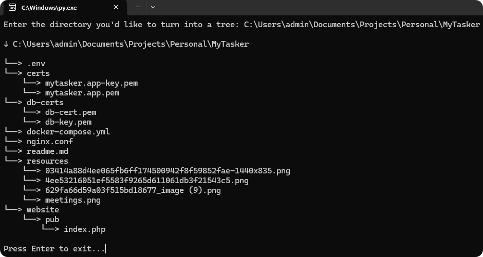

# PyTree

This project turns a directory of choice into a tree, similar to tree /f on Windows, tree -f on Linux, using recursion.

## Preview

  

## Compatability

This code was only tested on a machine running Windows.

## License

The MIT License lets you do almost anything you want with this project, even making and distributing closed source versions.

